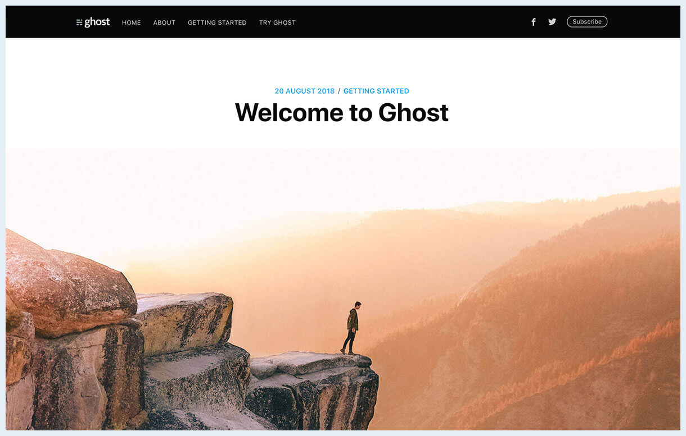
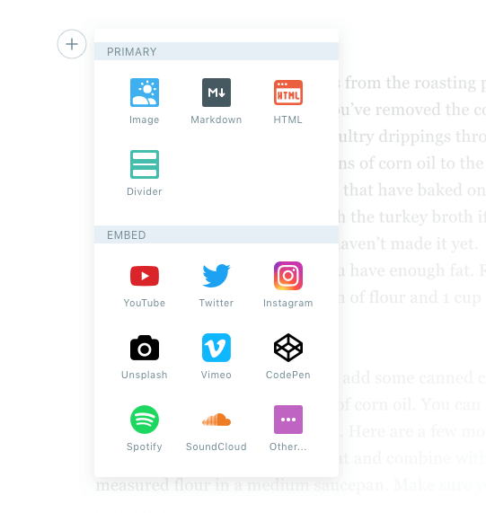
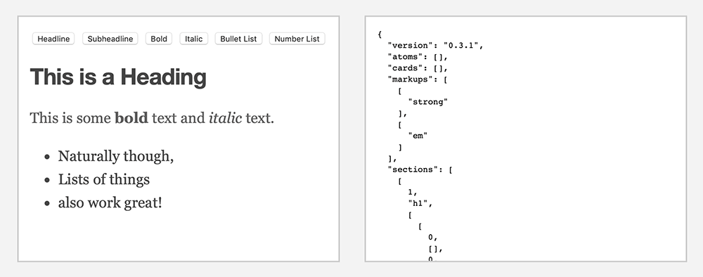

Posts are the primary entry-type within Ghost, and generally represent the majority of stored data.

By default Ghost will return a reverse chronological feed of posts in the traditional format of a blog. However, a great deal of customisation is available for this behaviour.

## Overview

Posts are created within Ghost-Admin using the editor to determine your site's main content. Within them are all the fields which you might expect such as title, description, slug, metadata, authors, tags and so on.

Additionally, posts have **Code Injection** fields which mean you can register additional styles, scripts or other content to be injected just before `</head>` or `</body>` on any one particular URL where desired.

Here's an example of a [post](https://demo.ghost.io/welcome/) in the default Ghost Theme:

## Creating content

Creating content in Ghost is done via the Ghost editor which, for many people, is what attracted to them in the first place. More than just a glossy experience though, Ghost's editor provides a streamlined workflow for both authors and developers.

### Writing experience

The writing experience in Ghost will be very familiar to most people who have spent time with web based authoring tools. It generally takes after the Medium-like experience which writers want.

Writing simple content is a breeze - but there are tons of powerful shortcuts, too. You can write plaintext, activating formatting options using either the mouse or keyboard shortcutcs. But you can also write in Markdown, if you prefer, and the editor will convert it as you type - rendering an instant preview.

Additionally, the editor contains intelligent logic around pasting. You can copy and paste from _most_ sources and it will be correctly transformed into readable content without needing any special treatment. (Go ahead, try copying the content of this page straight into the editor!) — You can also do things like pasting a URL over the top of any highlighted text to create a link.

### Dynamic cards

Having a clean writing experience is good, but nowadays great publishing means so much more than just text. Modern content contains audio, video, charts, data and interactive elements to provide an engaging experience.

Ghost content comes with extensible, rich media objects called Cards. The easiest way to think of them is like having Slack integrations in your content.

**For example:** Either by pressing the `+` button or typing `/` - you can trigger an Unsplash integration to find and insert a royalty-free photo for your post.

_Currently there are only a few simple cards available, but greater support for cards (as well as support for custom cards) is in active development._

### Document storage

The Ghost editor gets a lot of praise from writers for being a pleasure to use, but developers will find that the standardised JSON-based document storage format under the hood creates an equally great experience when it comes to working with the data.

All post content in Ghost is stored in [MobileDoc](https://github.com/bustle/mobiledoc-kit/blob/master/MOBILEDOC.md), and then rendered into its final form depending on the delivery destination.

Because MobileDoc is **Just JSON**™️, it's extremely portable and can be transformed into multiple formats. This is particularly powerful because it's just as easy to parse your content into HTML to render on the web as it is to pull the same content into a mobile app using completely different syntax.

Even the dynamic cards mentioned above are a part of MobileDoc! It's a fast growing open standard which is used by [Ghost](https://ghost.org), [Bustle](https://bustle.com), and an increasing number of other popular platforms and publications.

## Sample API data

Here's a sample post object from the Ghost [Content API](/api/content/)

`embed:api/v2/content/demo/posts.json`
